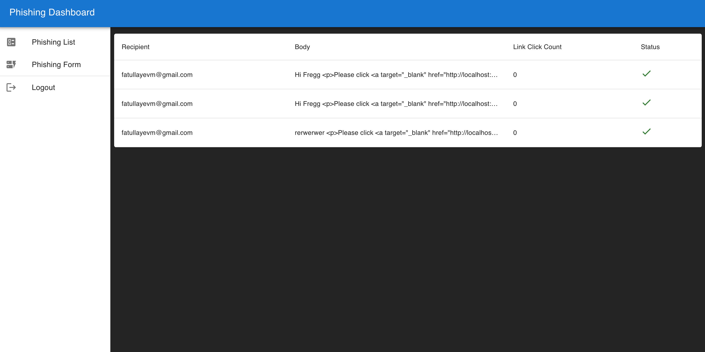

# Phishing Simulator Microservice

The Project is created to simulate phishing attacks. It consist of two Nest.js Microservices and React based UI. MainEntrypoint is Core service and another service is used to send malicious email, track user click , and get overall emails sent by user. Authenication is based on JWT. 


## Environment Variables

To run this project, You will need setup email credentials (look at easy solution on https://ethereal.email/create), Backend_API url on frontend and other keys on microservices 

`JWT_SECRET`=`xxxxxxx` - set it on core-service
--------------------------------
`SIMULATOR_URL`: `http://****` set phishing service url on core-service
--------------------------------
`MONGODB_URI`=`mongodb://xxxx` set it on both of Nets.js service
--------------------------------

`PHISHING_LINK` = `http://` set url of Phishing service 
--------------------------------
`EMAIL_HOST`: "smtp.***" -- set on Phishing service
--------------------------------
`EMAIL_USER`: "******" -- set on Phishing service
--------------------------------
`EMAIL_PASSWORD`: "***" -- set on Phishing service
--------------------------------
`PORT`= `XXXX` Core-Servise; 3000, Phishing: 3001, Frontend: 5173
--------------------------------
`VITE_PH_API`= `http://`  set core-service url on forntend
--------------------------------


## Running the solution

Run the overall app with docker-compose

```bash
  docker-compose up --build -d
```
For destroying 
```bash
  docker-compose down
```
    
## API Reference

#### Get All Phishing Emails

```http
  GET /attempts
```

| Parameter | Type     | Description                |
| :-------- | :------- | :------------------------- |

#### Create New Phishing email

```http
  POST /attempts
```

| Parameter | Type     | Description                       |
| :-------- | :------- | :-------------------------------- |
| `recipient`| `email` | **Required**. email of reciever |
| `body`     | `text` | **Required**. text to send       |


#### Login 

```http
  POST /auth/login
```

| Parameter | Type     | Description                       |
| :-------- | :------- | :-------------------------------- |
| `email`   | `email` | **Required**. email of user     |
| `password`| `text`  | **Required**. password for user |


#### Register 
```http
  POST /auth/register
```

| Parameter | Type     | Description                       |
| :-------- | :------- | :-------------------------------- |
| `email`   | `email` | **Required**. email of user     |
| `password`| `text`  | **Required**. password for user |


## Screenshot


